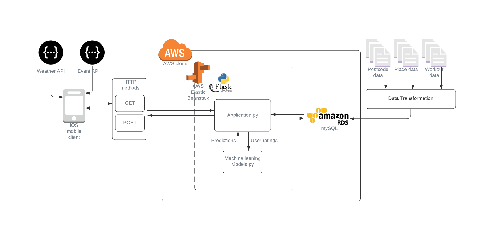

# IEserver
## 1. System architecture

## 2. Technical specifications

### 2.1 Application ([visit GitHub](https://github.com/kartbnb/ActiDiabet))
Compatibility: iOS 13.0 or later  
Develop IDE: Xcode  
Develop language: Swift 5.2  
User Interface: Storyboard  

### 2.2 Server
Framework: Flask  
Database connection: flask-mysql  
Develop IDE: Visual Studio Code  
Develop language: Python  

### 2.3 Database
Database: RDS for mySQL  
Service: AWS  

